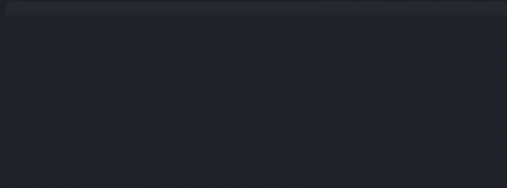

# Rosebox Langauge Server Extension

This extension provides the following features for files that match the pattern `*.rb.ts`:

- Shows color boxes next to colors.
- Provides color pickers that are visible upon hovering over a color.

## Third party software notices and information

Third party software notices and license information can be found in [ThirdPartyNotices.extension.txt](ThirdPartyNotices.extension.txt) and [ThirdPartyNotices.server.txt](ThirdPartyNotices.server.txt)